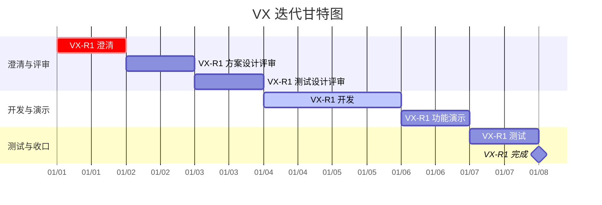

# 迭代甘特图模板

- version: `VX`
- updated_at: `YYYY-MM-DDTHH:MM:SS+08:00`

## 1. 使用规则
- 本图只展示已经进入 `需求台账.md` 和 `阶段看板.md` 的事实。
- 若阶段、依赖或 ETA 变化，先改事实源，再改本图。

## 2. 甘特图

```mermaid
gantt
    title VX 迭代甘特图
    dateFormat  YYYY-MM-DD
    axisFormat  %m/%d

    section 澄清与评审
    VX-R1 澄清 :crit, r1c, 2026-01-01, 1d
    VX-R1 方案设计评审 :r1d, after r1c, 1d
    VX-R1 测试设计评审 :r1t, after r1d, 1d

    section 开发与演示
    VX-R1 开发 :active, r1dev, after r1t, 2d
    VX-R1 功能演示 :r1demo, after r1dev, 1d

    section 测试与收口
    VX-R1 测试 :r1test, after r1demo, 1d
    VX-R1 完成 :milestone, r1done, after r1test, 0d
```
