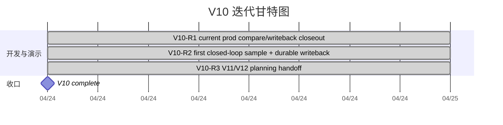

# 迭代甘特图

- version: `V10`
- updated_at: `2026-04-24T16:46:21+08:00`

## 1. 使用规则
- 本图只展示已经进入 `需求台账.md` 与 `阶段看板.md` 的事实。
- 若阶段、依赖或 ETA 变化，先改事实源，再改本图。

## 2. 甘特图

```mermaid
gantt
    title V10 迭代甘特图
    dateFormat  YYYY-MM-DD
    axisFormat  %m/%d

    section 开发与演示
    V10-R1 current prod compare/writeback closeout :done, v10r1, 2026-04-24, 1d
    V10-R2 first closed-loop sample + durable writeback :done, v10r2, 2026-04-24, 1d
    V10-R3 V11/V12 planning handoff :done, v10r3, 2026-04-24, 1d

    section 收口
    V10 complete :milestone, v10done, 2026-04-24, 0d
```
