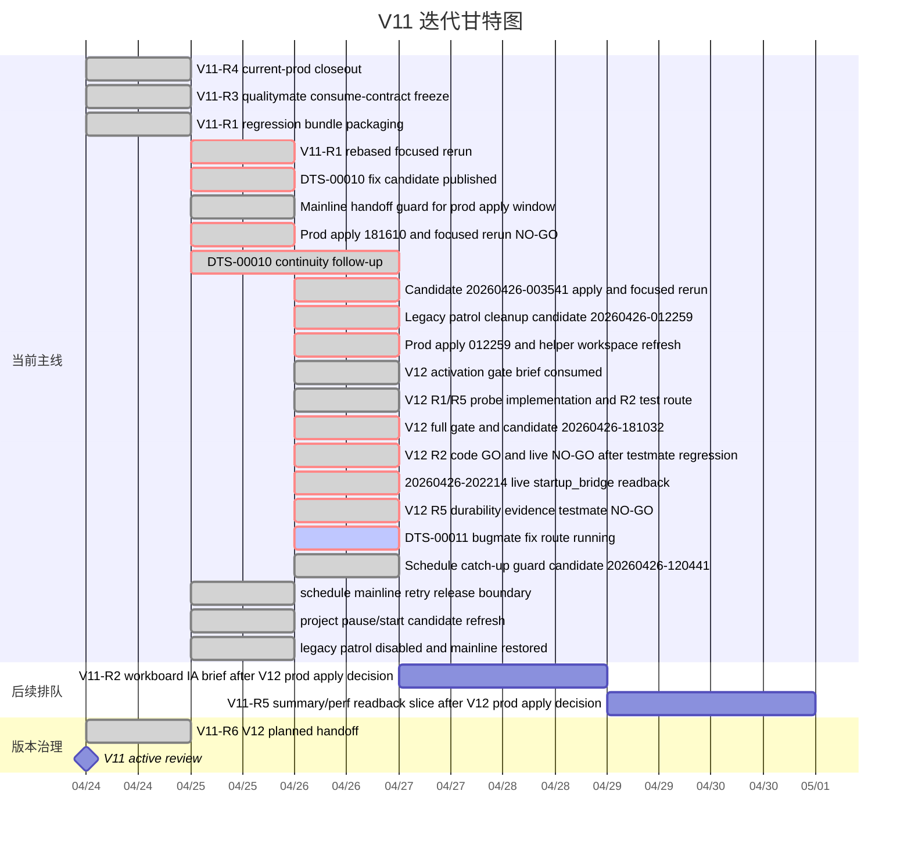

# 迭代甘特图

- version: `V11`
- updated_at: `2026-04-26T22:06:00+08:00`

## 1. 使用规则
- 本图只展示已经进入 `需求台账.md` 与 `阶段看板.md` 的事实。
- 若阶段、依赖或 ETA 变化，先改事实源，再改本图。

## 2. 甘特图

```mermaid
gantt
    title V11 迭代甘特图
    dateFormat  YYYY-MM-DD
    axisFormat  %m/%d

    section 当前主线
    V11-R4 current-prod closeout :done, v11r4a, 2026-04-24, 1d
    V11-R3 qualitymate consume-contract freeze :done, v11r3a, 2026-04-24, 1d
    V11-R1 regression bundle packaging :done, v11r1a, 2026-04-24, 1d
    V11-R1 rebased focused rerun :crit, done, v11r1b, 2026-04-25, 1d
    DTS-00010 fix candidate published :crit, done, v11r1c, 2026-04-25, 1d
    Mainline handoff guard for prod apply window :done, v11r1guard, 2026-04-25, 1d
    Prod apply 181610 and focused rerun NO-GO :crit, done, v11r1d, 2026-04-25, 1d
    DTS-00010 continuity follow-up :crit, done, v11r1e, 2026-04-25, 2d
    Candidate 20260426-003541 apply and focused rerun :crit, done, v11r1f, 2026-04-26, 1d
    Legacy patrol cleanup candidate 20260426-012259 :crit, done, v11r1g, 2026-04-26, 1d
    Prod apply 012259 and helper workspace refresh :crit, done, v11gate0, 2026-04-26, 1d
    V12 activation gate brief consumed :done, v11gate1, 2026-04-26, 1d
    V12 R1/R5 probe implementation and R2 test route :done, v11gate2, 2026-04-26, 1d
    V12 full gate and candidate 20260426-181032 :crit, done, v11gate3, 2026-04-26, 1d
    V12 R2 code GO and live NO-GO after testmate regression :crit, done, v11gate4, 2026-04-26, 1d
    20260426-202214 live startup_bridge readback :crit, done, v11gate5, 2026-04-26, 1d
    V12 R5 durability evidence testmate NO-GO :crit, done, v11gate6, 2026-04-26, 1d
    DTS-00011 bugmate fix route running :crit, active, v11gate7, 2026-04-26, 1d
    Schedule catch-up guard candidate 20260426-120441 :done, v11rel4, 2026-04-26, 1d
    schedule mainline retry release boundary :done, v11rel1, 2026-04-25, 1d
    project pause/start candidate refresh :done, v11rel2, 2026-04-25, 1d
    legacy patrol disabled and mainline restored :done, v11rel3, 2026-04-25, 1d

    section 后续排队
    V11-R2 workboard IA brief after V12 prod apply decision :v11r2, 2026-04-27, 2d
    V11-R5 summary/perf readback slice after V12 prod apply decision :v11r5, 2026-04-29, 2d

    section 版本治理
    V11-R6 V12 planned handoff :done, v11r6, 2026-04-24, 1d
    V11 active review :milestone, v11active, 2026-04-24, 0d
```
