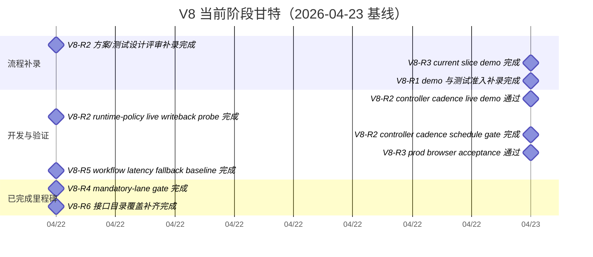

# V8 迭代甘特图

- version: `V8`
- updated_at: `2026-04-23T06:23:30+08:00`

## 1. 维护规则
- 本图只展示 `V8` 当前仍在推进或刚完成的关键需求。
- 阶段、依赖和时间窗口以 `需求台账.md` 与 `阶段看板.md` 为准；若两边冲突，以那两份事实源优先。

## 2. 甘特图

## 3. 文字版窗口
| 需求点 | 当前阶段 | 当前窗口 | 里程碑 |
| --- | --- | --- | --- |
| `V8-R1` | `released_done` | `2026-04-22 -> 2026-04-23` | demo/测试准入补录与切版退出口径已收口 |
| `V8-R2` | `released_done` | `2026-04-22 -> 2026-04-23` | runtime-policy live writeback probe、controller cadence schedule gate 与 live finalize/readback demo 都已完成；当前仅保留 residual finalize-stall 回归观察 |
| `V8-R3` | `released_done` | `2026-04-22 -> 2026-04-23` | current slice 的 demo 已补齐，phase3 `project-ops canonical header / workboard trim` 已移交 `V9-R3`，prod browser acceptance 也已通过 |
| `V8-R5` | `released_done` | `2026-04-22 -> 2026-04-22` | workflow latency auto -> task_execute fallback baseline 完成 |
