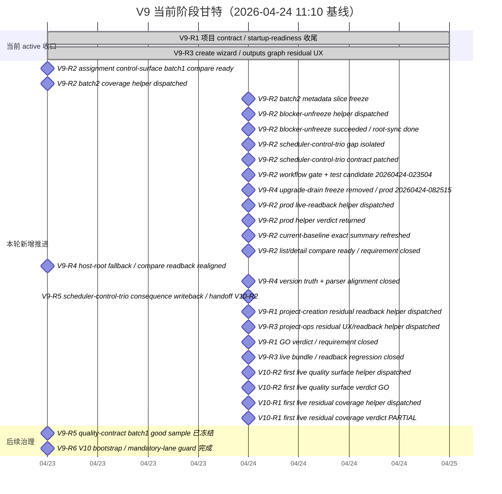

# V9 迭代甘特图

- version: `V9`
- updated_at: `2026-04-24T11:10:45+08:00`

## 1. 维护规则
- 本图只展示 `V9` 当前 active 版本的关键需求、已收口里程碑和下一刀窗口。
- 阶段、阻塞和下一门以 `需求台账.md` 与 `阶段看板.md` 为准；若冲突，以那两份事实源优先。

## 2. 甘特图

## 3. 文字版窗口
| 需求点 | 当前阶段 | 当前窗口 | 里程碑 |
| --- | --- | --- | --- |
| `V9-R1` | `released_done` | `2026-04-23 -> 已完成` | startup-readiness / project creation contract 已稳定，并由 `workflow_qualitymate node-20260424-095811-7cf8f0 / arun-20260424-100002-885d2e` 正式收成 `GO` |
| `V9-R2` | `released_done` | `2026-04-23 -> 已完成` | 2026-04-23 已把 batch1 刷到 `test/current=20260423-213946` 并把 compare review 追到 `ready/good`；2026-04-24 又先由 `blocker-unfreeze` 清掉 artifact-root/bootstrap 断点，再由 `pm-main@e8838e5` 收口 scheduler-control-trio 的 metadata/probe gap，最后通过 helper verdict + current-baseline exact summary 把 list/detail compare 正式刷到 `ready` |
| `V9-R3` | `released_done` | `2026-04-23 -> 已完成` | prod browser acceptance 已 pass；current prod bundle + `.repository/pm-main/.test/20260424-103436-705/report.md` 又把创建入口、honest readback 与产出主表达一起锁成 live baseline |
| `V9-R4` | `released_done` | `2026-04-23 -> 已完成` | current-version readback 与 `api_catalog_live_regression` compare 已重新对齐；`pm-main@c716742` 又把 upgrade drain freeze 拆掉并把 `prod` 恢复到 `20260424-082515`，当前再由 helper verdict + current-baseline exact summary 把版本真相与 parser 一起收口 |
| `V9-R5` | `released_done` | `2026-04-23 -> 已完成` | batch1 compare review 已冻结成 good；scheduler-control-trio 的后果回写已正式落盘，`V10-R2` 首条 live quality verdict 也已回交 `GO` |
| `V9-R6` | `released_done` | `2026-04-23 -> 已完成` | `V10` 已落成 planned 版本，最低配置泳道、`V11` 前置排期与 go/no-go 已可回读；`V10-R1` 首条 live residual coverage verdict 已回交 `PARTIAL`，当前只剩 `V10-R1-RC-001` 这条 exact live evidence gap |
